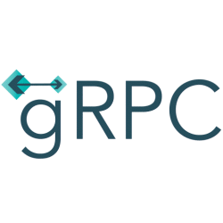

# Hello there 👋

I make elegantly professional **💻 Distributed Systems,  Microservice framework - Phoenix and 🌐 Website** for a living and also **Write some blogs**. 🌈    

* 🧐   Interested in java backend.
* 💼   Senior Back End Engineer at Quantex.
* 🎓   Bachelor of software engineering
* 🌱   Currently learning all interested
* 📚   Reading more about Apple, Harry Potter and how the computer works.
* 💻   With 4 years' software engineering education and 2 years' development working experience.
* ⛵   Encouraging people for open source collaborations.
* ✍🏻   I write my personal thoughts on Programming & Tech in my [Personal Blog](https://gyl-coder.top/)

**Some tag about me.**

- 🎉 Java Developer.
- Reader
- 🤪 traveler
- ...

**Skill**

  
  
  
  
    
  <a href="https://grafana.com/" target="_blank" >
    &nbsp;&nbsp;
  </a>
  
  
  
  
  
  
  
  
 

**gyl-coder/gyl-coder** is a ✨ _special_ ✨ repository because its `README.md` (this file) appears on your GitHub profile.

Here are some ideas to get you started:

- 🔭 I’m currently working on ...
- 🌱 I’m currently learning ...
- 👯 I’m looking to collaborate on ...
- 🤔 I’m looking for help with ...
- 💬 Ask me about ...
- 📫 How to reach me: ...
- 😄 Pronouns: ...
- ⚡ Fun fact: ...
  

  <i>Take a look at my repositories and let's get in touch!</i>

<!---->
       

